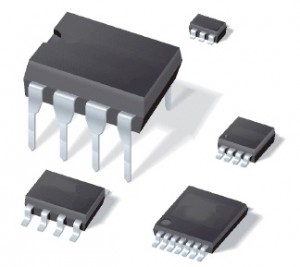
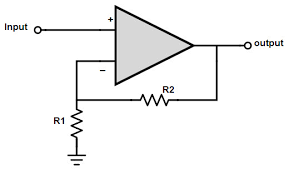
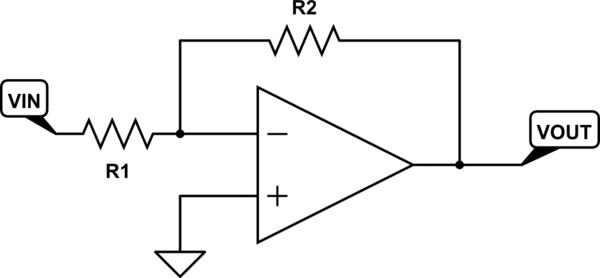
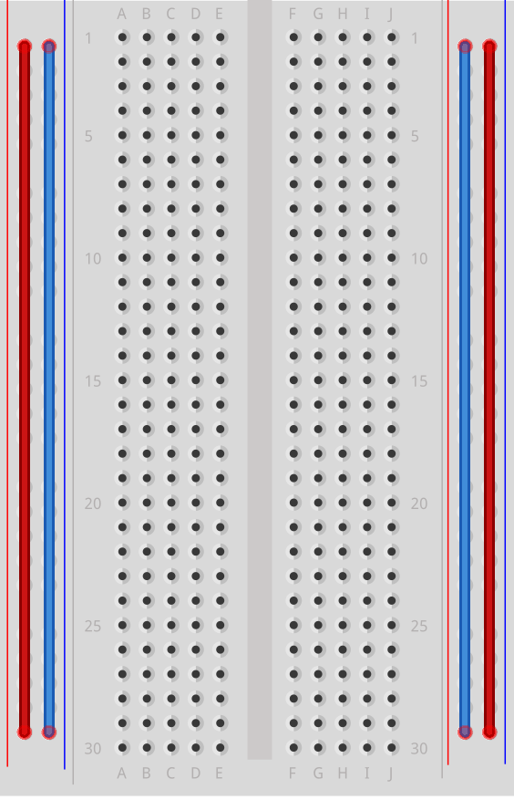
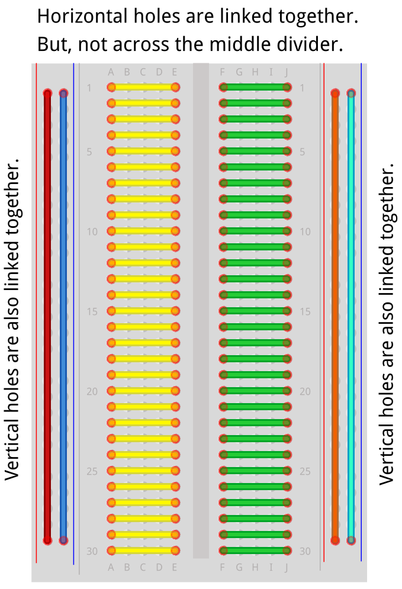
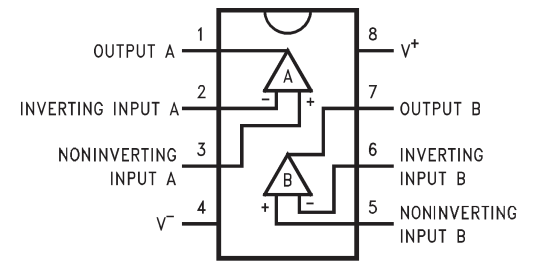
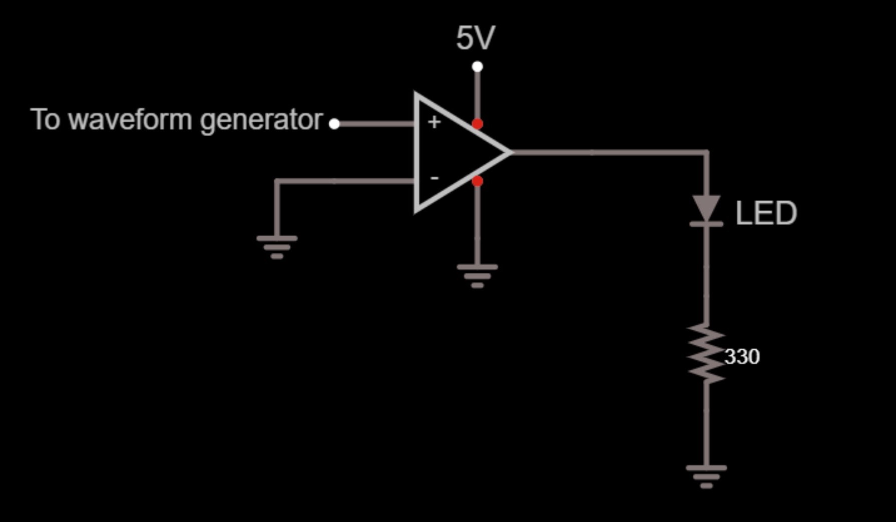
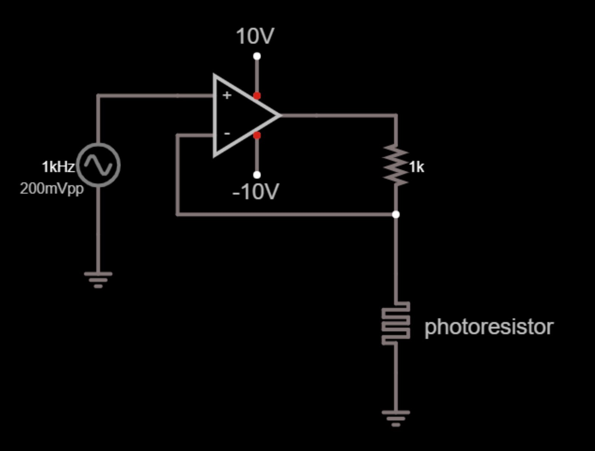

# Welcome to the Op Amp Lab!

Prerequisites: working understanding of voltage, current and resistors in circuits.

Credit to EE 16A for some of these resources.

## What are Op Amps?

Operational amplifiers, or op amps for short, are important components in analog circuits. The circuit symbol for an op amp and an example op amp package is shown below:

 

Op amps perform the function of amplifying the difference between the inputs of its 2 terminals; we’ll call these inputs V+ and V-. The output voltage can be represented as a function of these two:

This gain Av is built into the op amp, meaning we don’t have direct control over it. But most times this amount of gain is not desirable, so in order to control the output gain Vout/Vin, we configure the circuit into feedback. There are two main configurations of negative feedback: non-inverting and inverting.

The non-inverting amplifier:

The inverting amplifier:

We won’t go over how to derive these equations; circuit analysis is not in the scope of this lab. If you’re curious about where they come from, you can find out more by visiting: <insert link here>

As seen in the equations for non-inverting and inverting amplifiers, by appropriately choosing the values of R1 and R2 we can set the gain of our circuit. We will use this fact while building the circuit for today’s lab.

# Motivating Examples
 
Op-amps are used in a variety of circuits. If you ever want to multiply a voltage or flip its sign, you can use an op-amp to do that.

## Breadboard Overview

Breadboards have a series of holes that are connected internally so that you can easily prototype circuits using them. Just as a quick reminder from the first imaging lab, there are two types of connected lines in a breadboard - power rails, and internal rows. Power rails (blue and red, marked by the + and - signs) are connected to each other vertically as shown here:

The rows (in the center part of the breadboard) are numbered from 1 to 30 and are electrically connected across the row. Note: they are not connected across the center divider! This makes it very easy to plug op-amps (like you will be using later in this lab) into the breadboard - just place them so that they straddle the notch in the center of the board!

 
You can see these connections for yourselves! Take a look at the pictures below and follow them to open up the back of your breadboard to see the conductive wires. Please be careful when taking it apart; the metal pieces can fall out so if you do not want to risk losing pieces, do not do this.
 
# Comparator
Let’s see how an op-amp can compare two voltages. Here’s a diagram that illustrates how the LMC6482 chips work:

As mentioned above, a comparator will take in 2 input voltages and compare them to determine the voltage output. In the case of our op amp, these two inputs will be our V+ and V- terminals. The circuit you should build on the breadboard is shown as follows:

As we have not adjusted the gain through feedback, this means that we will have close to a gain of 100k! The op amp will try to output 100000(V+ - V-), but since we give it a maximum supply of VDD, it can only output up to VDD. It “railed”, so to speak.

Now that you have built the circuit, connect 5V to VDD of the op amp, and ground (0V) to the VSS of the op amp. Next, connect V- to ground, and V+ to the output of your waveform generator. We want to set the output load of the waveform generator to Hi-Z. To do so, do the following:

Push the button labelled with the channel number you are using (it should be right above where you plugged in the cable to the waveform generator).
Push the button underneath the screen that corresponds to the box labelled “Output load” on the screen.

Push the button corresponding to the box labelled “Hi-Z” on the screen.
We won’t go into why we want to do this, as that knowledge is not necessary and is beyond the scope of this lab.

Next, we need to set the output waveform. Push the button labelled “Waveforms”, and set the waveform to be a triangle wave. Then, push the button labelled Parameters, and set the following parameters:

Vpp (voltage peak to peak) should be 5V.
Frequency should be 50Hz.
Offset should be 0V.

To turn on the output, push the button with the channel number again, and toggle the output by pushing the button underneath the screen corresponding to the output. You should now see that the LED is blinking! This is because as the waveform’s voltage goes above V-, which is set to 0V, the comparator op amp will see that V+ > V-, and therefore output VDD, turning the LED on. When the waveform goes below 0V, V+ < V-, and the op amp will output VSS (0V), turning the LED off.
 
Congratulations! You have implemented a basic op amp comparator circuit! We’ll now be moving on to a slightly more complicated circuit, the non-inverting amplifier, using a photoresistor to control the gain.
 
## Photoresistor Non-inverting Amplifier
 
So now we have seen negative feedback amplifiers in theory and comparators in practice. Let's see if we can put what we've learned together with some photo-reactive elements (elements that are impacted by light) to build an interesting amplifier.

 
#### Photoresistors
 
Photoresistors are variable resistors that change their resistance value with different light intensities. The photoresistors we will be using vary from 50 to 100k.